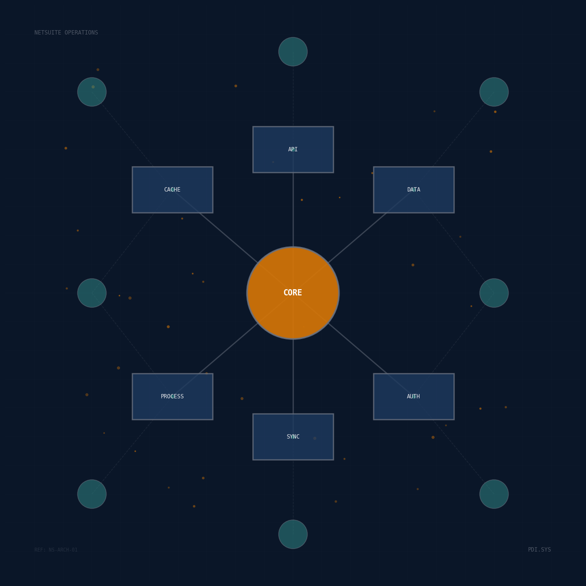

# NetSuite Operations


This repository hosts software components, integrations, and documentation for NetSuite implementations at PDI Technologies. The contents support operational workflows across multiple business functions by providing standardized interfaces, reusable modules, and technical reference materials.

## Purpose

NetSuite serves as a critical ERP system within PDI's technology infrastructure. This repository consolidates resources that extend NetSuite's capabilities, streamline integration patterns, and document best practices for development teams working with the platform.

## Structure

The repository organizes resources into distinct categories:

### Knowledge Base

Technical documentation covering NetSuite development patterns and integration approaches:

- **Authentication** - OAuth 2.0, token-based authentication, and credential management for SuiteTalk and RESTlet endpoints
- **RESTlets** - Custom REST endpoint development using SuiteScript 2.x
- **SuiteScript Modules** - Reference documentation for N/https, N/record, N/search, and other core modules
- **SuiteTalk REST API** - Standard REST web services for record operations and metadata queries
- **SuiteCloud SDK Framework** - CLI tools, project structure, and deployment workflows
- **Third-Party SDKs** - Integration libraries for Node.js, Python, and other platforms
- **Open Source Projects** - Community tools and frameworks for NetSuite development

<div align="center">
  
</div>

## Repository Structure

```
/opt/ns/
├── kb/                    # NetSuite knowledge base (documentation)
├── apps/                  # Application suite
│   └── vendor-analysis/   # Vendor cost analysis CLI (Python)
├── .claude/               # Development workflows
└── assets/                # Repository assets
```

### Knowledge Base

Technical documentation in `kb/` covering NetSuite development patterns:

- **authentication.md** - OAuth 2.0 implementation (TBA deprecated Feb 2025)
- **restlets.md** - Custom REST endpoints with SuiteScript 2.x
- **suitescript-modules.md** - N/https, N/record, N/search references
- **suitetalk-rest-api.md** - Standard REST web services
- **suitecloud-sdk-framework.md** - CLI tools and deployment
- **third-party-sdks.md** - Integration libraries (Node.js, Python)
- **open-source-projects.md** - Community tools

### Applications

#### vendor-analysis (Python CLI)

Read-only NetSuite vendor cost analysis application.

**Features:**
- Sync vendors and transactions from NetSuite (OAuth 2.0)
- Analyze vendor spend and identify top vendors
- Detect duplicate vendors using fuzzy matching
- Local PostgreSQL storage for fast analysis

**Tech Stack:**
- Python 3.12+ with UV package manager
- Typer CLI framework
- SQLAlchemy + PostgreSQL
- Ruff (linting/formatting) + Pyright (strict type checking)
- NetSuite SuiteTalk REST API

**Quick Start:**
```bash
cd apps/vendor-analysis
uv sync
uv run vendor-analysis --help
```

See [apps/vendor-analysis/README.md](apps/vendor-analysis/README.md) for complete documentation.

The `.claude/` directory contains development workflow configurations and is excluded from production deployments.

## Usage

Clone this repository to access reference materials during NetSuite development work:

```bash
git clone https://github.com/PDI-Technologies/ns.git
cd ns
```

Documentation files can be viewed directly in any markdown reader or through the GitHub web interface.

## Development

### Build & Development Tasks

Repository-level Makefile provides build and development commands:

```bash
# Install all app dependencies
make install

# Build all applications
make build

# Code quality (all apps)
make typecheck
make lint
make format

# Bootstrap applications
make bootstrap-vendor

# Clean build artifacts
make clean
```

See `make help` for all available commands.

## Contributing

This repository follows standard git workflows. Create feature branches for additions or updates, then submit pull requests for review before merging to main.

Maintain consistency with existing documentation structure. Include code examples where applicable and link to official Oracle NetSuite documentation for authoritative references.

## Technical Stack

- **NetSuite SuiteCloud Platform** - Primary integration target
- **SuiteScript 2.x** - Server-side JavaScript execution environment
- **SuiteTalk REST/SOAP** - Web services APIs
- **SuiteCloud SDK** - Command-line development tools

## License

Internal PDI Technologies repository. All rights reserved.
