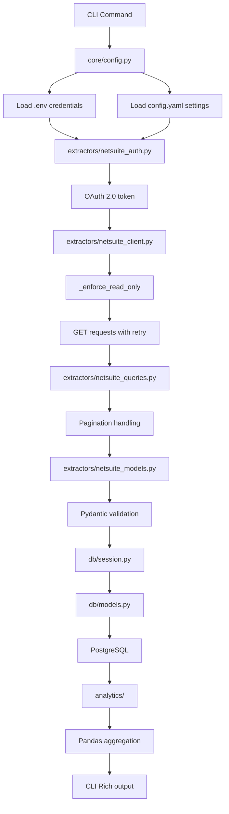

# Financial Analytics - Architecture Documentation

## Overview

Financial Analytics is a production-grade Python CLI application that extracts financial data from NetSuite, stores it in PostgreSQL, and provides comprehensive financial analysis and reporting.

## Design Philosophy

### 1. Fail-Fast Discipline

Following CLAUDE.md guidelines:
- No default values for critical configuration
- No exception swallowing
- Missing credentials = immediate application failure
- All errors propagate with clear messages

### 2. Read-Only Enforcement

NetSuite client enforces GET-only operations:
- `_enforce_read_only()` method validates HTTP methods
- Raises `ReadOnlyViolationError` for write attempts
- Data flows one direction: NetSuite → PostgreSQL → Analysis

### 3. Type Safety

Strict Pyright mode with comprehensive type hints:
- All function parameters and return values typed
- Pydantic validation at API boundaries
- SQLAlchemy typed mappings (Python 3.12+ syntax)
- No type: ignore suppressions

### 4. Module Size Discipline

All modules kept under 300 lines:
- Clear separation of concerns
- Single responsibility per module
- Easy to understand and maintain

## Layer Architecture

```
┌─────────────────────────────────────────────────────────────┐
│                    CLI LAYER (cli/)                         │
│  main.py: Typer app with 5 commands                        │
│  init.py, sync.py, analyze.py: Command implementations     │
├─────────────────────────────────────────────────────────────┤
│              ANALYTICS LAYER (analytics/)                   │
│  vendor_analysis.py: Spend, duplicates, Pareto analysis    │
│  revenue_analysis.py: Trends, LTV, growth calculations     │
├─────────────────────────────────────────────────────────────┤
│     DATA ACCESS LAYERS (extractors/ & db/)                 │
│  ┌─────────────────┬─────────────────────────────────────┐ │
│  │ NetSuite Layer  │   PostgreSQL Layer                  │ │
│  │  netsuite_auth  │   models.py: Star schema           │ │
│  │  netsuite_client│   - Dimension tables (vendors, etc)│ │
│  │  netsuite_queries│   - Fact tables (bills, invoices) │ │
│  │  netsuite_models│   - Analysis cache tables          │ │
│  │                 │   session.py: Connection management │ │
│  └─────────────────┴─────────────────────────────────────┘ │
├─────────────────────────────────────────────────────────────┤
│              CORE LAYER (core/)                             │
│  config.py: Dual-source configuration                      │
│  exceptions.py: Custom exception hierarchy                 │
│  constants.py: Immutable values                            │
└─────────────────────────────────────────────────────────────┘
```

## Data Flow



## Module Responsibilities

### Core Layer

**config.py** - Configuration management
- Loads credentials from .env using pydantic-settings
- Loads settings from config.yaml using PyYAML
- Validates all configuration at startup
- Provides properties for composite values (database_url, etc)
- Fail-fast: Missing config files cause immediate failure

**exceptions.py** - Exception hierarchy
- Base: `FinancialAnalyticsError`
- Specialized: Configuration, NetSuite, Database, Validation errors
- No exception swallowing anywhere in codebase

**constants.py** - Immutable values
- Frozen sets for allowed HTTP methods
- API URL templates
- Default configuration values

### Extractors Layer

**netsuite_auth.py** - OAuth 2.0 authentication
- `OAuth2Token` dataclass with expiration tracking
- `NetSuiteAuth` class manages token lifecycle
- Automatic refresh when expired (60-second buffer)
- Fail-fast: Auth failures raise immediately

**netsuite_client.py** - HTTP client
- Read-only enforcement via `_enforce_read_only()`
- Retry logic with exponential backoff
- Context manager for resource cleanup
- Comprehensive error handling
- Fail-fast: No silent failures

**netsuite_models.py** - Pydantic data models
- Match NetSuite API field names (camelCase preserved)
- Vendor, VendorBill, Customer, Invoice, Account, Transaction
- NetSuiteResponse for pagination handling
- Strict validation at API boundary

**netsuite_queries.py** - Data extraction functions
- `fetch_all_vendors()` - Paginated vendor extraction
- `fetch_vendor_bills()` - Transaction extraction
- `fetch_all_customers()` - Customer data
- `fetch_invoices()` - Invoice data
- `fetch_chart_of_accounts()` - GL accounts

### Database Layer

**models.py** - SQLAlchemy star schema
- **Dimension Tables:**
  - `DimVendor` - Vendor master
  - `DimCustomer` - Customer master
  - `DimAccount` - Chart of accounts
- **Fact Tables:**
  - `FactVendorBill` - Vendor transactions
  - `FactInvoice` - Customer invoices
- **Analysis Cache:**
  - `VendorSpendAnalysis` - Pre-computed vendor metrics
  - `RevenueTrends` - Monthly revenue aggregations
  - `FinancialKPIs` - Cached financial ratios

**session.py** - Session management
- `create_db_engine()` - Engine factory
- `get_session()` - Session factory with error handling
- `init_database()` - Idempotent schema creation

### Analytics Layer

**vendor_analysis.py** - Vendor analytics
- `VendorSpendSummary` dataclass - Analysis results
- `analyze_vendor_spend()` - Aggregate with Pandas
- `get_top_vendors()` - Top N ranking
- `calculate_similarity()` - Fuzzy string matching
- `detect_duplicate_vendors()` - Pairwise comparison
- `DuplicatePair` dataclass - Duplicate results

**revenue_analysis.py** - Revenue analytics
- `RevenueTrendData` dataclass - Trend metrics
- `analyze_revenue_trends()` - Monthly aggregation with growth rates
- `CustomerLifetimeValue` dataclass - LTV metrics
- `calculate_customer_ltv()` - Customer value analysis

### CLI Layer

**main.py** - Application entry point
- Typer app configuration
- Command registration
- Top-level error handling only
- Fail-fast: Exceptions caught only at entry for user messages

**init.py** - Database initialization
- Idempotent schema creation
- Rich Panel output
- Configuration validation

**sync.py** - Data synchronization
- NetSuite to PostgreSQL sync
- Progress bars for user feedback
- Upsert pattern (merge) for incremental sync
- Transaction commit after batch

**analyze.py** - Analysis commands
- Vendor spend tables
- Revenue trend tables
- Duplicate detection output
- Customer LTV reporting
- Rich table formatting throughout

## Configuration Strategy

### Dual-Source Pattern

**.env** - Credentials (never commit)
```env
NS_CLIENT_ID=...
NS_CLIENT_SECRET=...
DB_USER=...
DB_PASSWORD=...
```

**config.yaml** - Application settings (committed)
```yaml
database:
  host: localhost
  port: 5432
  name: financial_analytics

netsuite:
  account_id: "TSTDRV123456"

analytics:
  default_period_months: 12
  vendor_analysis_top_n: 25
  duplicate_threshold: 0.85
  page_size: 100
  max_retries: 3
  retry_delay_seconds: 2
```

Both files are REQUIRED. Application fails immediately if either is missing.

## Technology Choices

### Why These Tools?

**UV over pip/poetry:**
- 10-100x faster dependency resolution
- Built in Rust
- Automatic virtual environment management
- Compatible with standard pyproject.toml

**Ruff over flake8/black:**
- 10-100x faster (Rust-based)
- Replaces 6+ tools
- Auto-fix support

**Pyright over mypy:**
- 3-5x faster
- Stricter default checking
- Better IDE integration

**Typer over argparse:**
- Type-based argument parsing
- Automatic help generation
- Better developer experience

**Rich over print:**
- Tables, progress bars, panels
- Colored output
- Better user experience

**httpx over requests:**
- Async-capable (future-ready)
- Built-in retry support
- Better timeout handling

**Pandas over raw SQL:**
- Rich aggregation functions
- Time series operations
- Growth rate calculations

## Database Schema Design

### Star Schema Benefits

1. **Query Performance** - Denormalized for fast aggregation
2. **Analytics-Friendly** - Dimensions separate from facts
3. **Historical Tracking** - Time dimension for trend analysis
4. **Flexibility** - Easy to add new dimensions

### Indexing Strategy

```sql
-- Fact tables indexed on FK and date
CREATE INDEX idx_vendor_bills_vendor_date ON fact_vendor_bills(vendor_id, tran_date);
CREATE INDEX idx_invoices_customer_date ON fact_invoices(customer_id, tran_date);

-- Dimension tables indexed on natural keys
CREATE INDEX idx_vendors_name ON dim_vendors(company_name);
CREATE INDEX idx_customers_name ON dim_customers(company_name);
```

## Error Handling Strategy

### Exception Hierarchy

```
FinancialAnalyticsError (base)
├── ConfigurationError (missing/invalid config)
├── NetSuiteConnectionError (API connection failure)
├── NetSuiteAPIError (API error response)
├── ReadOnlyViolationError (write attempt)
├── DatabaseError (database operation failure)
├── SalesforceConnectionError (Salesforce API failure)
└── DataValidationError (data validation failure)
```

### Error Propagation

Errors are caught ONLY at:
- CLI main entry point (for user-friendly messages)
- Retry mechanisms (re-raise after max attempts)

NO try/catch in:
- Business logic
- Data extraction
- Database operations
- Analytics calculations

This ensures errors surface immediately with full context.

## Performance Optimizations

### API Efficiency

1. **Pagination** - Fetch in configurable batches (default 100)
2. **Selective Fields** - Only fetch required columns
3. **Retry Logic** - Exponential backoff for transient failures
4. **Connection Reuse** - httpx client reuses connections

### Database Efficiency

1. **Batch Inserts** - Merge operations in batches
2. **Indexed Queries** - All FKs and dates indexed
3. **Analysis Cache** - Pre-computed results for dashboards
4. **Connection Pooling** - SQLAlchemy engine pooling

### Analytics Efficiency

1. **Pandas Aggregation** - Fast groupby operations
2. **Database Aggregation** - Push computation to database
3. **Incremental Sync** - Only fetch changed data
4. **Cached Results** - Store analysis results for reuse

## Future Enhancements

### Planned Features

1. **Salesforce Integration** - Revenue pipeline analysis
2. **Budget Variance** - Actual vs budget comparison
3. **Cash Flow Metrics** - DSO, DPO, CCC calculations
4. **Financial Ratios** - Profitability, efficiency, leverage
5. **Forecasting** - Time series forecasting with Prophet
6. **Anomaly Detection** - Statistical outlier detection
7. **Export Features** - Excel, CSV, PDF reports
8. **Web Dashboard** - React PWA for visualization

### Integration Points

- **Salesforce MCP** - Already available via mcp__pdi-salesforce-sse3__*
- **Database MCP** - Already available via mcp__mssql__*
- **Archon KB** - Search NetSuite documentation
- **Context7** - External library documentation

## Comparison with vendor-analysis

### Similarities

- Read-only NetSuite client
- Fail-fast configuration
- Dual-source config (.env + YAML)
- PostgreSQL + SQLAlchemy
- UV + Ruff + Pyright
- Rich CLI output
- Module size discipline

### Differences

| Feature | vendor-analysis | financial-analytics |
|---------|----------------|---------------------|
| Scope | Vendor cost only | Comprehensive financial |
| Schema | Simple tables | Star schema |
| Analytics | Vendor spend + duplicates | Vendor, revenue, KPIs, forecasting |
| Integrations | NetSuite only | NetSuite + Salesforce |
| CLI Commands | 4 commands | 5+ commands |
| Cache Tables | None | Pre-computed analytics |
| Purpose | Vendor consolidation | Enterprise financial reporting |

## Skills Applied

This application demonstrates patterns from:

1. **python-cli-engineering** skill:
   - UV package management
   - Typer CLI framework
   - Rich console output
   - Fail-fast discipline
   - Strict Pyright typing
   - Module organization

2. **financial-analytics** skill:
   - Revenue trend analysis
   - Vendor spend analysis
   - KPI calculations
   - Time series patterns
   - Dashboard design principles

3. **netsuite-integrations** skill:
   - OAuth 2.0 authentication
   - SuiteTalk REST API
   - Pagination patterns
   - Error handling
   - Read-only enforcement

4. **CLAUDE.md** guidelines:
   - No emojis in production code
   - Professional documentation
   - No Claude Code attribution
   - Fail-fast approach
   - Type safety

## Development Workflow

```bash
# Setup
cd apps/financial-analytics
uv sync
cp .env.example .env
# Edit .env with credentials
# Edit config.yaml with settings

# Initialize
make init

# Sync data
make sync

# Analyze
uv run fin-analytics analyze
uv run fin-analytics vendors --top 25
uv run fin-analytics revenue --months 12

# Code quality
make typecheck  # Pyright strict mode
make lint       # Ruff linting
make format     # Ruff formatting
```

## Deployment Considerations

### Database Setup

```sql
-- Create database
CREATE DATABASE financial_analytics;

-- Create user with limited permissions
CREATE USER fin_analytics WITH PASSWORD 'secure_password';
GRANT ALL PRIVILEGES ON DATABASE financial_analytics TO fin_analytics;
```

### Environment Configuration

Production .env should have:
- Strong PostgreSQL password
- NetSuite production account ID
- OAuth 2.0 credentials with appropriate permissions

### Security

- .env file never committed to git
- Read-only NetSuite access reduces risk
- Database credentials encrypted at rest
- OAuth 2.0 tokens expire after 1 hour
- No write operations to NetSuite

## Testing Strategy

### Manual Testing

Application designed for production use with real data:
1. Configure .env and config.yaml
2. Run `init` to create schema
3. Run `sync` to fetch NetSuite data
4. Run analysis commands to verify calculations
5. Verify Rich table output formatting

### Type Safety Testing

Pyright strict mode catches:
- Type errors
- Missing type annotations
- Invalid function calls
- Incorrect return types

### Linting

Ruff catches:
- Code style issues
- Import ordering
- Unused imports
- Complexity issues

## Related Resources

- **vendor-analysis** app: Simpler vendor-focused application
- **financial-analytics** skill: Comprehensive analytics patterns
- **netsuite-integrations** skill: Integration patterns
- **python-cli-engineering** skill: CLI best practices
- **NetSuite KB**: `/opt/ns/kb/` documentation files
