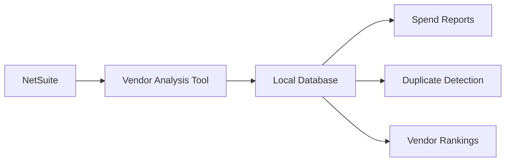
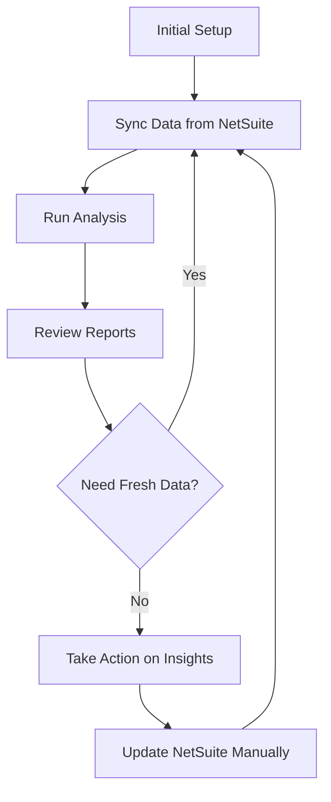

# Vendor Analysis Overview

## What It Does

Vendor Analysis is a tool that helps you understand and manage your vendor spending by automatically pulling data from NetSuite and analyzing it to reveal actionable insights.

## Key Benefits

### 1. Visibility Into Vendor Spend

Get a clear picture of where your money is going across all vendors, ranked by total spend. No more manual spreadsheet work or running complex NetSuite reports.

### 2. Identify Duplicate Vendors

Automatically detect vendors that might be duplicates due to naming variations. For example, "ABC Company", "ABC Co", and "ABC Company Inc" could all be the same vendor, leading to:
- Split payment terms
- Missed volume discounts
- Inaccurate spend reporting
- Difficulty tracking vendor relationships

### 3. Make Data-Driven Decisions

Use accurate, up-to-date vendor data to:
- Negotiate better rates with high-spend vendors
- Consolidate vendor relationships
- Identify cost-saving opportunities
- Improve procurement strategies

## How It Works



The tool connects to your NetSuite account, downloads vendor and transaction data, stores it locally for fast analysis, and generates reports that help you make informed decisions.

## Common Use Cases

### Procurement Review

**Challenge:** Finance needs to review vendor spending before quarterly business reviews but NetSuite reports are slow and difficult to customize.

**Solution:** Run vendor analysis to instantly see top vendors by spend, with transactions broken down by period.

### Vendor Consolidation

**Challenge:** Multiple departments are working with similar vendors under different names, missing out on volume discounts.

**Solution:** Use duplicate detection to identify vendors that should be consolidated, potentially saving thousands in negotiated rates.

### Budget Planning

**Challenge:** Need to forecast vendor expenses for next year's budget but historical data is scattered across multiple NetSuite saved searches.

**Solution:** Pull all vendor transaction history into one place and analyze spending trends to inform budget decisions.

### Audit Preparation

**Challenge:** Auditors need detailed vendor spend breakdowns, but generating these reports from NetSuite is time-consuming.

**Solution:** Generate comprehensive vendor analysis reports in minutes rather than hours.

## What You Get

### Spend Analysis Report

See your top vendors ranked by total spend, including:
- Vendor name
- Total amount spent
- Number of transactions
- Transaction period

Example output:
```
Top 10 Vendors by Spend
─────────────────────────────────────────────
Rank  Vendor Name           Total Spend  Txns
─────────────────────────────────────────────
  1   Office Supplies Co    $125,450     89
  2   Tech Solutions Inc    $98,230      23
  3   Shipping Partners     $76,890      156
  4   Marketing Agency      $65,000      12
  5   Cloud Services LLC    $52,400      12
...
```

### Duplicate Vendor Detection

Identify potential duplicate vendors with similarity scores:
```
Potential Duplicate Vendors
────────────────────────────────────────────────
Vendor 1              Vendor 2              Score
────────────────────────────────────────────────
ABC Company          ABC Co                92%
Tech Solutions Inc   Tech Solutions LLC    88%
Office Supply Co     Office Supplies Co    95%
...
```

## Data Security

### Read-Only Access

The tool only reads data from NetSuite - it never writes or modifies anything. Your NetSuite data remains unchanged.

### Local Storage

All vendor and transaction data is stored in a local database on your infrastructure. You maintain complete control over your data.

### Secure Authentication

Uses industry-standard OAuth 2.0 authentication to connect to NetSuite securely.

## Typical Workflow



1. **Setup:** Configure connection to NetSuite and local database
2. **Sync:** Pull latest vendor and transaction data
3. **Analyze:** Run spend analysis or duplicate detection
4. **Review:** Examine reports and identify opportunities
5. **Act:** Make decisions based on insights
6. **Repeat:** Sync fresh data periodically for ongoing analysis

## Business Impact

### Time Savings

- **Before:** Hours spent creating custom NetSuite searches and exporting to Excel for analysis
- **After:** Minutes to sync data and generate comprehensive reports

### Cost Reduction

- **Vendor Consolidation:** Identify duplicate vendors to consolidate relationships and negotiate volume discounts
- **Spend Visibility:** Spot unexpectedly high spending early and take corrective action

### Better Decisions

- **Data-Driven:** Make procurement decisions based on actual spend patterns, not assumptions
- **Proactive:** Regular analysis helps you stay ahead of budget issues rather than reacting to them

## Getting Started

To begin using Vendor Analysis, you will need:

1. **NetSuite Access:** OAuth credentials for read-only API access
2. **Database:** PostgreSQL database for local data storage
3. **Technical Setup:** Initial configuration by IT team

Once configured, running analysis is as simple as executing a few commands. Your IT team can provide training on the basic operations.

## Future Capabilities

Potential enhancements being considered:

- **Trend Analysis:** Track vendor spend changes over time with visual charts
- **Budget Tracking:** Compare actual vendor spend against budgeted amounts
- **Automated Alerts:** Receive notifications when spending exceeds thresholds
- **Payment Terms Analysis:** Identify opportunities to optimize cash flow through payment term negotiations
- **Category Analysis:** Break down spending by vendor category or department

## Questions?

For technical setup and support, contact your IT team.

For questions about how to use vendor analysis insights in your procurement or finance processes, contact the Finance Operations team.
